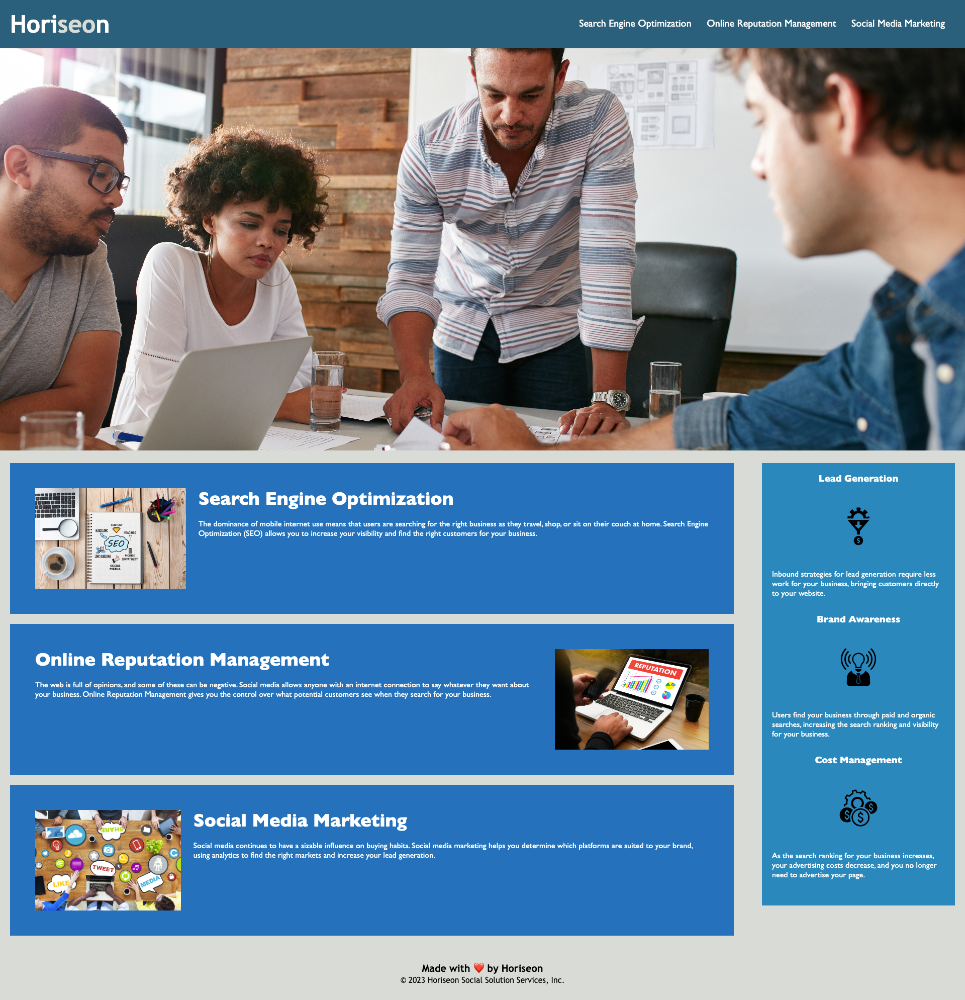

# Horiseon Accessibility Site

## Description

This project is to improve the accessibility and functionality for end users, increasing the overall experience. It does so by incorporating code enhancements that not only enhances search engine optimization, but also makes navigation easier for the company's target audience, including those with impairments. 

- I was motivated by the business and community impact of this project.
- Poor SEO and dips in market utilization are correlated.
- I refactored code to improve how the site look and what it does at the user level
- Optimization drives reputation, which drives user experience. 

## Table of Contents (Optional)

If your README is long, add a table of contents to make it easy for users to find what they need.

- [Usage](#usage)
- [Credits](#credits)
- [License](#license)

## Usage

Follow the steps below to use or test the website:

1. Go to your browser.
2. Visit the address listed below.
3. Click a link on the navigation bar to view additional information. 

Site: https://g6-2flyy.github.io/horiseon-accessibility-site/
    

    

## Credits

https://www.markdownguide.org/cheat-sheet/

https://gist.github.com/lukas-h/2a5d00690736b4c3a7ba

https://coding-boot-camp.github.io/full-stack/github/professional-readme-guide

## MIT License

Copyright (c) 2023 G6-2Flyy

Permission is hereby granted, free of charge, to any person obtaining a copy of this software and associated documentation files (the "Software"), to deal in the Software without restriction, including without limitation the rights to use, copy, modify, merge, publish, distribute, sublicense, and/or sell copies of the Software, and to permit persons to whom the Software is furnished to do so, subject to the following conditions:

The above copyright notice and this permission notice shall be included in all copies or substantial portions of the Software.

THE SOFTWARE IS PROVIDED "AS IS", WITHOUT WARRANTY OF ANY KIND, EXPRESS OR IMPLIED, INCLUDING BUT NOT LIMITED TO THE WARRANTIES OF MERCHANTABILITY, FITNESS FOR A PARTICULAR PURPOSE AND NONINFRINGEMENT. IN NO EVENT SHALL THE AUTHORS OR COPYRIGHT HOLDERS BE LIABLE FOR ANY CLAIM, DAMAGES OR OTHER LIABILITY, WHETHER IN AN ACTION OF CONTRACT, TORT OR OTHERWISE, ARISING FROM, OUT OF OR IN CONNECTION WITH THE SOFTWARE OR THE USE OR OTHER DEALINGS IN THE SOFTWARE.

## Features

- Page title
- URL/ Web address
- Link text
- Image alt text
- Headers